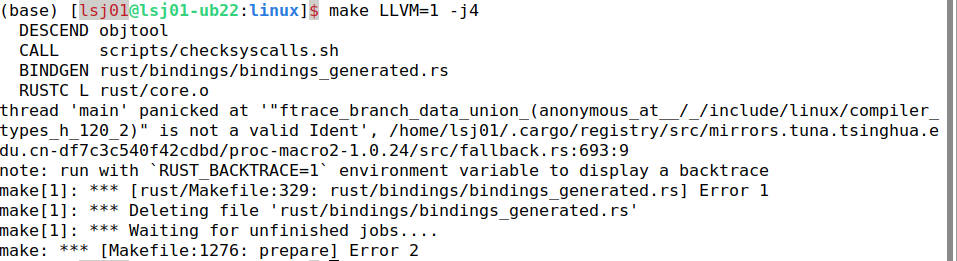
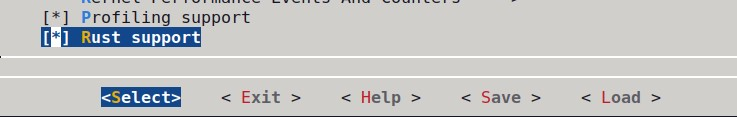
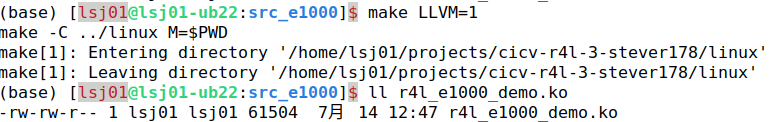
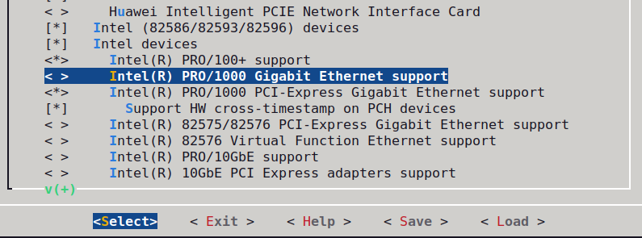
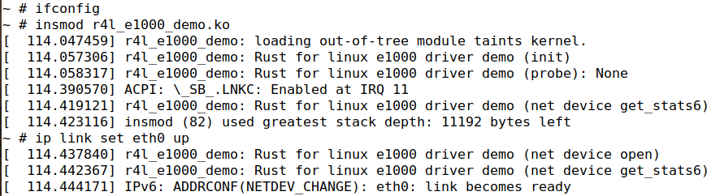
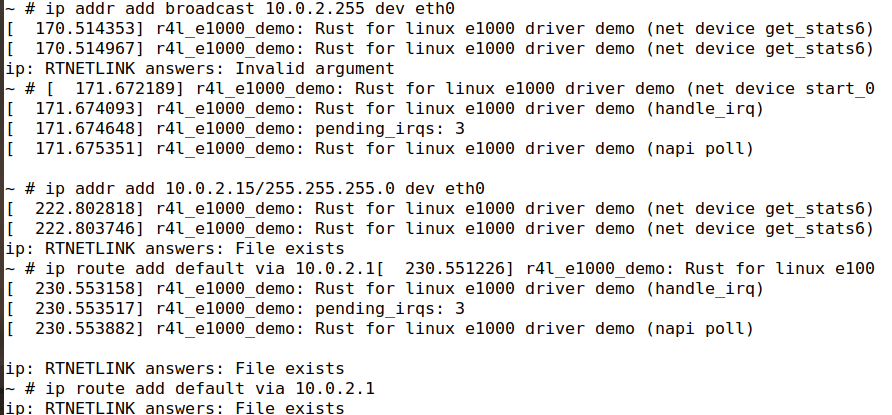
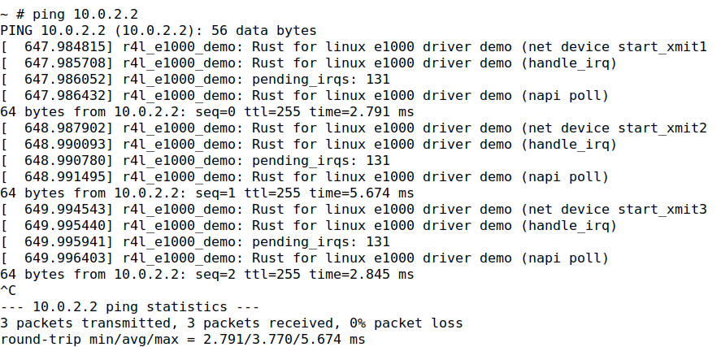
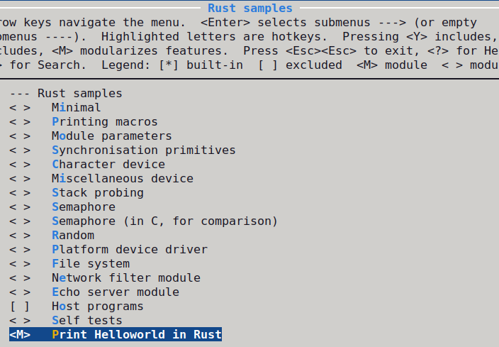
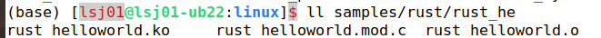
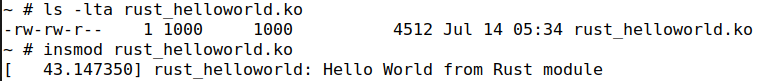

[](https://classroom.github.com/a/VsbltiDW)

# 第四期训练营-第三周rust for linux 作业
作业链接: [第三周rust for linux 作业说明](https://docs.qq.com/doc/DSk5xTHRJY1FZVUdK)

## 进展
- 完成了前3个作业；
- 更新系统中的依赖后，无法完成内核编译，即 
	- 感谢 [飞扬-匿名联合体解析问题](https://github.com/cicvedu/cicv-r4l-3-creatoy/blob/master/Notes.md) 给出的思路
	- 尝试了 llvm-14 和 llvm-18 后，没有解决问题

## 作业1：编译Linux内核
进入Linux文件夹，使用如下命令进行编译

```shell
make x86_64_defconfig
make LLVM=1 menuconfig
#set the following config to yes
General setup
---> [*] Rust support
make LLVM=1 -j$(nproc)
```

即


最后在Linux文件夹下，得到一个名为vmlinux的文件


## 作业2：对Linux内核进行一些配置
1.	步骤和截图

编译r4l_e1000模块


禁用默认e1000网卡驱动


手动配置以联网




2.	两个问题
- Q1：在src_e1000文件夹下的Makefile中，默认执行default目标，进入文件夹linux，将当前工作目录的绝对路径作为参数，嵌套调用内核的Makefile。
- Q2：src_e1000通过自己的Makefile来嵌套调用内核的Makefile；通过Kbuild指定模块编译后生成的目标文件的名称；模块被编译后需要加载到内核中。


## 作业3：使用rust编写一个简单的内核模块并运行
修改samples/rust的Kconfig和Makefile，使得


编译内核之后得到


启动镜像之后


## 作业4：为e1000网卡驱动添加remove代码
未完成

## 作业5：注册字符设备
未完成

## 项目小试验
未完成

#